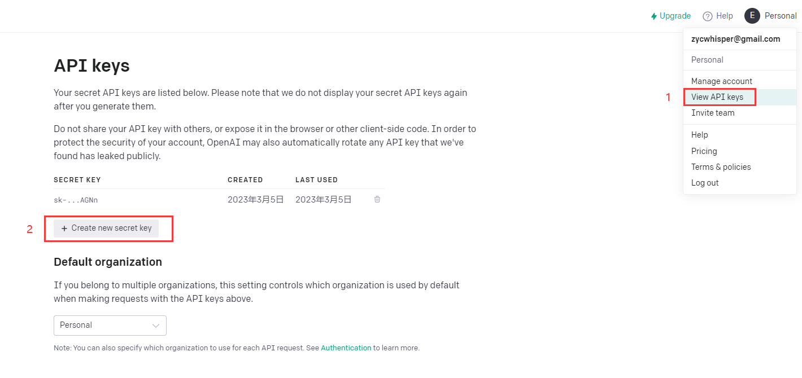

# 概述

以 OpenAI 提供的官方 API 为基础，利用 Python 作为主要的开发语言，再以 Gradio 库作为前端框架，最后将工程部署到 Hugging Face 平台，完成一个能通过浏览器在任意设备上访问的、具有简单用户界面的聊天机器人应用

# OpenAI 平台相关

## API 调用

要调用官方提供的 API，必须先注册 OpenAI 账户，然后根据图示生成 API Key



## 基本概念

+ 写代码之前，先参考[官方文档](https://platform.openai.com/docs/introduction/overview)，理解几个关键的基本概念，包括 prompt, completion, token 的含义
+ 阅读代码时，参考 [API 接口文档](https://platform.openai.com/docs/guides/chat/introduction)，理解 API 本身提供的参数含义

# 功能逻辑

## 环境配置

+ 把示例工程拉取到本地

  ```bash
  git clone git@gitee.com:EasonZhong312/simple-chat-gpt.git
  ```

+ 下载 [Python3](https://www.python.org/downloads/)，下载 IDE(建议使用 Jetbrains 的 [PyCharm](https://www.jetbrains.com/pycharm/download/#section=windows))

+ 设置环境变量：往 `Path` 这个环境变量加上 `xxx\Python\Python311` 和 `xxx\Python\Python311\Scripts`两条记录

+ 在示例工程的根目录下打开命令行，执行命令：`pip install -r requirements.txt`

  > 这一步是根据 requirements.txt 列出的内容，安装对应的依赖库

+ 用 PyCharm 打开示例工程，运行，正常情况下会看到以下提示，至此环境已经成功搭建

  

## 本地运行

+ 打开浏览器，访问 `localhost:7860`，可以本地运行该应用
+ 每次改完代码，都要重新运行

# 前端框架

+ 整个 UI 框架是基于 Gradio 库完成的，无需复杂的 `html + css + js` 开发，直接使用已有的UI组件即可，具体方法参考工程内的代码，以及 [Gradio 文档](https://gradio.app/docs/) 

# 部署

+ 把代码里最后一句 `blocks.launch()`改成`blocks.launch(share=True)`，会生成一个临时的公共链接 `xxxxx.gradio.app`，实际上是以你本机作为 server 的一个代理链接，有效期为 24 小时，期间只要你的 python 程序处于运行状态，其他设备就能访问这个链接

+ 如果要把这个应用分享给其他人，还需要将工程部署到远端，这里我们选择 Hugging Face 平台

+ 参考文档：[Sharing Your App](https://gradio.app/sharing-your-app/)，将工程部署到 Hugging Face，选择默认的硬件配置可以免费部署，文档中有详细的操作步骤，跟着操作就可以。这一步完成后，工程就在远端跑起来了

+ 把新建的 Space 的可见性设为 **Public**，再选择 `Embed this Space`，会生成一个访问远端服务器的新链接，至此其他设备也都能通过浏览器体验这个应用了

  

# 一些思考

+ 必须有意识地持续提高自身英文水平，尤其是英文文档的阅读能力。今后 OpenAI 的发展动向必定最先以英文的形式呈现，所有的中文内容都至少是二手信息，即便中文开发者人数众多，有很多值得借鉴，但也不乏依靠信息优势贩卖焦虑、危言耸听者。英文能力是今后辨别是非、判断趋势的重要基础
+ 提高对各类信息的整合能力，包括对相关资讯、日常场景应用的敏锐度，以及快速吸收和迭代新技术的能力
+ 持续学习、持续积累，努力拓宽知识面和视野，才能看到更多可能性

