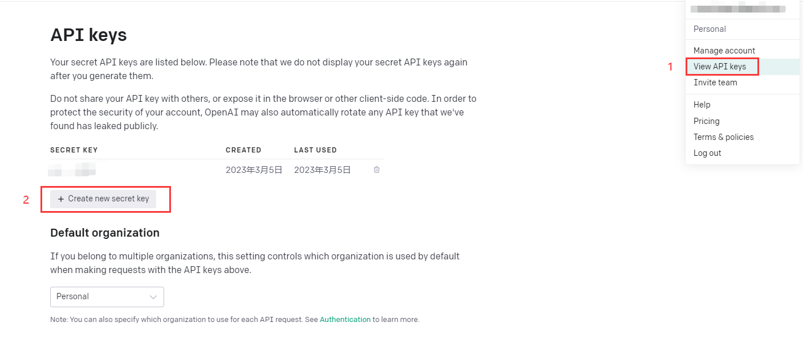

# 概述

- 以 OpenAI 提供的官方 API 为核心，以 Python 为开发语言，以 Gradio 库作为前端框架(无需繁琐的 `html + css + js` 开发)，最后将工程部署到 Hugging Face 平台，完成一个能通过浏览器在任意设备上访问的、具有简单用户界面的聊天机器人应用

- 本文将首先提供工程源码，着重于介绍工程的配置、调试和部署等过程，不赘述具体的功能实现，有效代码量很短(200行左右)，参考注释阅读即可

- 下图为成品概览，除了普通的文字对话，还加入了语音输入、预设角色(可自行扩展)等功能

  

# OpenAI 平台相关

## API 调用

要调用官方提供的 API，必须先注册 OpenAI 账户(需要梯子)，然后根据图示生成 API Key



## 基本概念

+ 写代码之前，先参考[官方文档](https://platform.openai.com/docs/introduction/overview)，理解几个关键的基本概念，包括 prompt, completion, token 的含义
+ 阅读代码时，参考 [API 接口文档](https://platform.openai.com/docs/guides/chat/introduction)，理解 API 本身提供的参数含义

# 环境配置

+ 把示例工程拉取到本地

  ```bash
  git clone git@gitee.com:EasonZhong312/simple-chat-gpt.git
  ```

+ 下载 [Python3](https://www.python.org/downloads/)，下载 IDE(建议使用 Jetbrains 的 [PyCharm](https://www.jetbrains.com/pycharm/download/#section=windows))

+ 设置环境变量：往 `Path` 这个环境变量加上 `xxx\Python\Python311` 和 `xxx\Python\Python311\Scripts`两条记录

+ 在示例工程的根目录下打开命令行，执行命令：`pip install -r requirements.txt`

  > 这一步是根据 requirements.txt 列出的内容，安装对应的依赖库

+ 用 PyCharm 打开示例工程，运行，正常情况下会看到以下提示，至此环境已经成功搭建

  

# 本地运行

+ 打开浏览器，访问 `localhost:7860`，可以本地运行该应用
+ 每次改完代码，都要重新运行

# 部署

+ 把代码里最后一句 `blocks.launch()`改成`blocks.launch(share=True)`，会生成一个临时的公共链接 `xxxxx.gradio.app`，实际上是以你本机作为 server 的一个代理链接，有效期为 24 小时，期间只要你的 python 程序处于运行状态，其他设备就能访问这个链接

+ 如果要把这个应用分享给其他人，还需要将工程部署到远端，这里我们选择 Hugging Face 平台。选择默认的硬件配置可以免费部署，详细步骤参考文档：[Sharing Your App](https://gradio.app/sharing-your-app/)，跟着 gif 操作就可以。这一步完成后，程序就在远端跑起来了

+ 把新建的 Space 的可见性设为 **Public**，再选择 `Embed this Space`，会生成一个访问远端服务器的新链接，把链接分享给其他人，其他设备就也通过浏览器体验这个应用了

  

+ # 安全性

  这里涉及到的安全性问题，核心在于 OpenAI 的 API Key，因为对 API 的每次调用都在花钱(即便每个开发者都有 18 刀的初始额度)，因此我们首先要保证 **API Key 的值不泄露**，其次要保证**程序不被其他人滥用**，这里只提供最简单的实现思路，详细的实现参考代码

  - 保证 API Key 的值不泄露：可以把它作为环境变量来处理。例如只有部署了这个程序的服务器上存有这个环境变量，就避免了把它以明文的方式写死在代码里，或是以配置的方式留在代码仓库中，从而被人盗用。Hugging Face 支持对服务器配置环境变量：Space 主页 → Settings → Repository secrets

    

  - 保证程序不被他人滥用：增加登录校验环节，只有输入正确的密码才能进入应用(参考代码中的`certify_auth(username, password)`)；密码也以环境变量的方式存在服务器上

